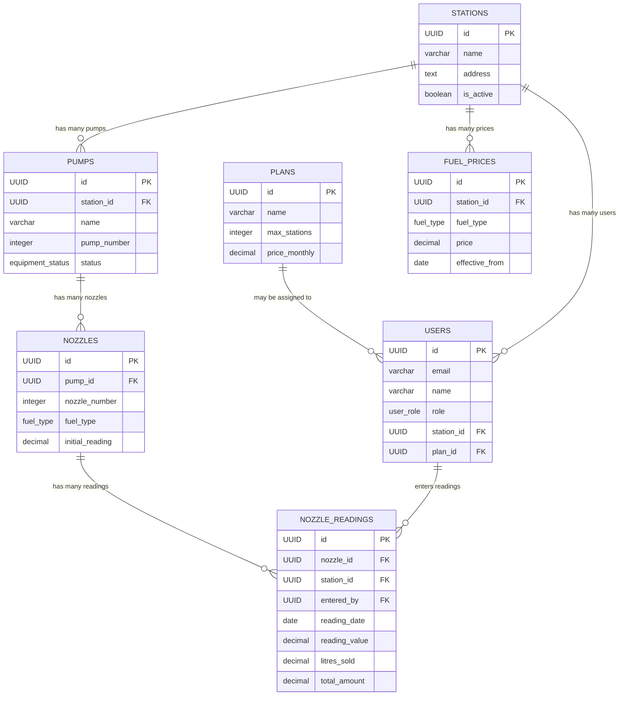

```mermaid
erDiagram
    PLANS {
        UUID id PK
        varchar name
        integer max_stations
        decimal price_monthly
    }

    STATIONS {
        UUID id PK
        varchar name
        text address
        boolean is_active
    }

    USERS {
        UUID id PK
        varchar email
        varchar name
        user_role role
        UUID station_id FK
        UUID plan_id FK
    }

    PUMPS {
        UUID id PK
        UUID station_id FK
        varchar name
        integer pump_number
        equipment_status status
    }

    NOZZLES {
        UUID id PK
        UUID pump_id FK
        integer nozzle_number
        fuel_type fuel_type
        decimal initial_reading
    }

    FUEL_PRICES {
        UUID id PK
        UUID station_id FK
        fuel_type fuel_type
        decimal price
        date effective_from
    }

    NOZZLE_READINGS {
        UUID id PK
        UUID nozzle_id FK
        UUID station_id FK
        UUID entered_by FK
        date reading_date
        decimal reading_value
        decimal litres_sold
        decimal total_amount
    }

    PLANS ||--o{ USERS : "may be assigned to"
    STATIONS ||--o{ USERS : "has many users"
    STATIONS ||--o{ PUMPS : "has many pumps"
    PUMPS ||--o{ NOZZLES : "has many nozzles"
    NOZZLES ||--o{ NOZZLE_READINGS : "has many readings"
    STATIONS ||--o{ FUEL_PRICES : "has many prices"
    USERS ||--o{ NOZZLE_READINGS : "enters readings"

    %% Notes
    %% - Ownership model: SQL uses users.station_id (each user optionally linked to one station).
    %% - Docs mention many-to-many assignments (user_stations) and stations.owner_id which are NOT present in SQL.
    %% - Additional tables referenced in docs (sales, tender_entries, daily_closure) are absent from the SQL schema.
```
