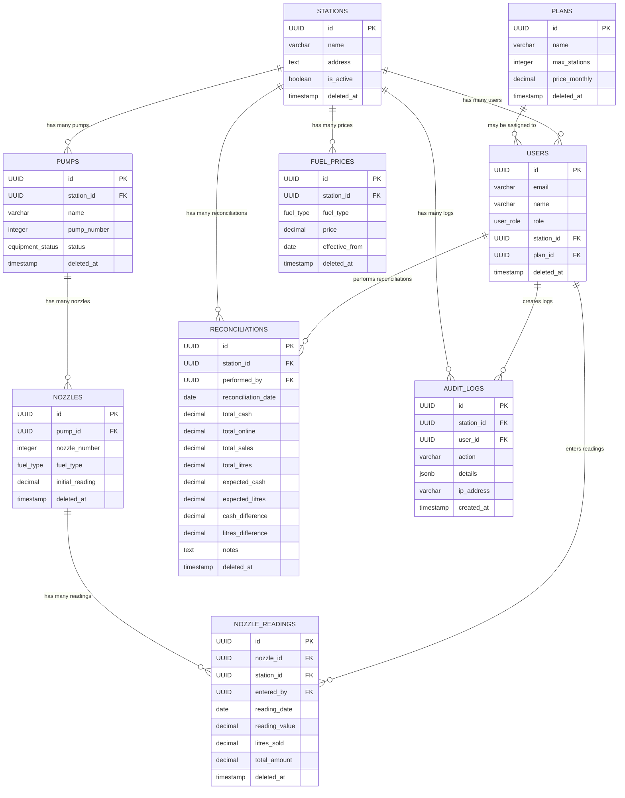

## API & Database Matrix Flow

This section describes how API endpoints interact with database tables and how data flows through the system.

| API Endpoint         | DB Table(s) Involved         | Typical Flow/Interaction                |
|----------------------|-----------------------------|-----------------------------------------|
| /login               | USERS                       | Auth, role check                        |
| /stations            | STATIONS, USERS             | CRUD, assign users                      |
| /pumps               | PUMPS, STATIONS             | CRUD, link to station                   |
| /nozzles             | NOZZLES, PUMPS              | CRUD, link to pump                      |
| /fuel-prices         | FUEL_PRICES, STATIONS       | CRUD, fetch latest                      |
| /readings            | NOZZLE_READINGS, NOZZLES    | Create, fetch, aggregate                |
| /creditors           | CREDITORS, STATIONS         | CRUD, assign to station                 |
| /credit-transactions | CREDIT_TRANSACTIONS         | Create, fetch, update creditor          |
| /shifts              | SHIFTS, USERS, STATIONS     | Create, close, fetch                    |
| /cash-handovers      | CASH_HANDOVERS, SHIFTS      | Create, fetch, link to shift            |
| /reconciliation      | RECONCILIATIONS, USERS      | Create, fetch, aggregate                |
| /audit-logs          | AUDIT_LOGS, USERS, STATIONS | Log every critical action               |

### Example Data Flows

#### Sale Entry
1. User logs in (`USERS`)
2. Selects station/pump/nozzle (`STATIONS`, `PUMPS`, `NOZZLES`)
3. Enters meter reading (`NOZZLE_READINGS`)
4. API calculates litres sold, total amount, payment breakdown
5. Updates related shift/cash handover (`SHIFTS`, `CASH_HANDOVERS`)
6. Logs action (`AUDIT_LOGS`)

#### Reconciliation
1. Manager triggers reconciliation (`RECONCILIATIONS`)
2. API aggregates readings, sales, cash, online payments
3. Compares expected vs actual, records differences
4. Logs reconciliation (`AUDIT_LOGS`)

#### Credit Sale
1. User selects creditor (`CREDITORS`)
2. Records credit transaction (`CREDIT_TRANSACTIONS`)
3. Updates creditor balance
4. Logs transaction (`AUDIT_LOGS`)

### Flow Visualization (Summary)
- User/API → DB Table → Related Table(s) → Audit Log
- Most actions start with a user, interact with a main table, update related tables, and log the action.

---
