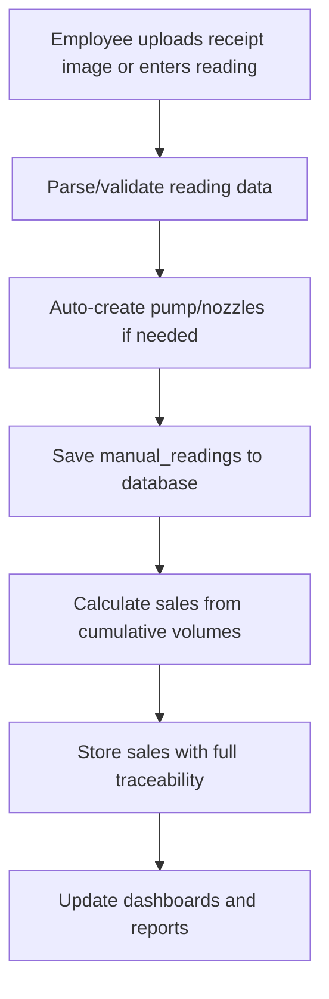

# FuelSync Multi-Tenant Architecture

## Overview

FuelSync has been redesigned as a comprehensive multi-tenant fuel station management system. This architecture supports multiple fuel stations with complete data isolation, role-based access control, and scalable receipt-processing-based sales tracking.

## Core Concepts

### Station-Based Multi-Tenancy

Every data operation is scoped to a **Station**:
- Users belong to stations (except Super Admins)
- Pumps, nozzles, prices, and sales are station-specific
- Complete data isolation between stations
- Centralized management for Super Admins

### User Hierarchy

```
Super Admin
├── Station Owner A
│   ├── Manager A1
│   ├── Employee A1
│   └── Employee A2
├── Station Owner B
│   ├── Manager B1
│   └── Employee B1
└── Station Owner C
    └── Employee C1
```

### Data Flow



## Database Schema

### Core Tables

#### Stations
- `id`: UUID primary key
- `name`: Station name
- `location`: Physical location
- `address`: JSON with detailed address
- `contact_info`: JSON with contact details
- `license_number`: Fuel retail license
- `is_active`: Status flag

#### Users
- `id`: UUID primary key
- `station_id`: Foreign key to stations
- `role`: ENUM (super_admin, owner, manager, employee)
- `plan_id`: Foreign key to plans
- `custom_limits`: JSON for Super Admin overrides

#### Pumps
- `id`: UUID primary key
- `station_id`: Foreign key to stations
- `pump_sno`: Physical pump serial number
- `name`: Display name
- `location`: Position within station

#### Nozzles
- `id`: UUID primary key
- `pump_id`: Foreign key to pumps
- `nozzle_id`: INTEGER (1-8)
- `fuel_type`: ENUM (petrol, diesel)
- `max_flow_rate`: DECIMAL

#### Manual Readings
- `id`: UUID primary key
- `station_id`: Foreign key to stations
- `pump_id`: Foreign key to pumps
- `nozzle_id`: INTEGER
- `cumulative_volume`: DECIMAL(12,3)
- `reading_date`: DATE
- `reading_time`: TIME
- `is_manual_entry`: BOOLEAN

#### Sales
- `id`: UUID primary key
- `station_id`: Foreign key to stations
- `reading_id`: Current reading
- `previous_reading_id`: Previous reading
- `litres_sold`: Calculated difference
- `price_per_litre`: From fuel_prices
- `total_amount`: Calculated total

### Key Constraints

1. **Station Isolation**: All data queries include `station_id`
2. **Unique Readings**: No duplicate readings per pump/nozzle/datetime
3. **Sales Validation**: `total_amount = litres_sold * price_per_litre`
4. **Role Validation**: Owners/Employees must have `station_id`

## Business Logic

### Sales Calculation

Sales are calculated using **cumulative volume differences**:

```typescript
function calculateSales(currentReading: ManualReading, previousReading: ManualReading) {
  const litresSold = currentReading.cumulativeVolume - previousReading.cumulativeVolume;
  const fuelPrice = getFuelPrice(currentReading.stationId, currentReading.fuelType);
  const totalAmount = litresSold * fuelPrice.price;
  
  return {
    litresSold,
    pricePerLitre: fuelPrice.price,
    totalAmount: parseFloat(totalAmount.toFixed(2))
  };
}
```

### Receipt Processing / Manual Reading Flow

1. **Image Upload or Manual Entry**: Employee uploads receipt image or enters meter reading with `pump_sno`
2. **Parse & Validate**: Attempt to parse structured data from uploaded receipt when available; otherwise use manual entry fields
3. **Custom Parsing (optional)**: Optionally run text-parsing helpers to extract structured data
4. **Validation**: Verify pump exists, create if needed
5. **Deduplication**: Check for existing readings
6. **Sales Calculation**: Compare with previous readings
7. **Storage**: Save `manual_readings` and calculated sales

### Auto-Creation Logic

When parsed data or manual entry finds new pump/nozzle combinations:

```typescript
// Default fuel type mapping
const fuelTypeMap = {
  1: 'petrol',  // Nozzle 1 -> Petrol
  2: 'petrol',  // Nozzle 2 -> Petrol  
  3: 'diesel',  // Nozzle 3 -> Diesel
  4: 'diesel'   // Nozzle 4 -> Diesel
};

// Create pump if it doesn't exist
if (!pump) {
- Full receipt-parsing / manual-entry-to-sales pipeline
    stationId,
- Invalid parsed receipt data
    name: `Pump ${extractedData.pump_sno}`,
    status: 'active'
  });
}

// Create nozzles based on parsed or manual input
for (const nozzleId of foundNozzleIds) {
  await Nozzle.create({
    pumpId: pump.id,
    nozzleId,
    fuelType: fuelTypeMap[nozzleId] || 'petrol'
  });
}
```

## API Endpoints

### Station Management
- `GET /api/stations` - List stations (Super Admin only)
- `POST /api/stations` - Create station (Super Admin only)
- `PUT /api/stations/:id` - Update station (Owner/Super Admin)

### User Management
- `GET /api/users` - List users (filtered by station)
- `POST /api/users/employees` - Create employee (Owner only)
- `PUT /api/users/:id/role` - Update role (Super Admin only)

### Readings API
- `POST /api/readings/upload` - Upload receipt or reading
- `POST /api/readings/manual` - Create manual reading
- `GET /api/readings` - Get readings (station-filtered)

### Sales & Reports
- `GET /api/sales` - Get sales data (station-filtered)
- `GET /api/sales/daily/:date` - Daily summary
- `GET /api/reports/station-summary` - Station performance

## Role-Based Access Control

### Super Admin
- Full access to all stations and data
- Can create/modify stations and owners
- Can override plan limits with custom limits
- System-wide reporting and analytics

### Station Owner
- Full access to their station's data
- Can manage employees and managers
- Can set fuel prices for their station
- Can view detailed reports and analytics

### Manager
- Can view station data and reports
- Can create manual readings
- Can manage day-to-day operations
- Cannot modify station settings

### Employee
- Can upload receipts for OCR processing
- Can create manual readings
- Can view basic sales data
- Limited to their daily work scope

## Security & Isolation

### Data Isolation
- All queries include `station_id` filtering
- Database constraints prevent cross-station access
- API endpoints enforce station-based permissions

### Authentication
- JWT tokens include user's `station_id`
- Middleware validates station access
- Role-based route protection

### Plan Limits
- Upload limits per day/user
- Employee count limits per station
- Pump count limits per station
- Custom overrides for Super Admin flexibility

## Testing Strategy

### Unit Tests
- Sales calculation logic
- Parsing / manual entry validation
- Station isolation validation
- Role permission enforcement

### Integration Tests
- Full OCR-to-sales pipeline
- Multi-station data separation
- API endpoint security
- Database constraint validation

### Edge Case Testing
- Duplicate readings
- Meter resets (negative volumes)
- Missing fuel prices
- Invalid OCR data
- Network failures during processing

## Migration from Single-Tenant

### Data Migration
1. Create default station for existing data
2. Assign all users to default station
3. Update all existing records with `station_id`
4. Validate data integrity

### API Compatibility
- Maintain backward compatibility where possible
- Add station context to all responses
- Update frontend to handle multi-tenant data

## Performance Considerations

### Database Indexing
```sql
-- Core performance indexes
CREATE INDEX idx_manual_readings_station_date ON manual_readings(station_id, reading_date DESC);
CREATE INDEX idx_sales_station_date ON sales(station_id, sale_date DESC);
CREATE INDEX idx_pumps_station_sno ON pumps(station_id, pump_sno);
CREATE INDEX idx_fuel_prices_lookup ON fuel_prices(station_id, fuel_type, valid_from DESC);
```

### Query Optimization
- Always include `station_id` in WHERE clauses
- Use materialized views for complex aggregations
- Implement pagination for large datasets
- Cache frequently accessed fuel prices

### Monitoring
- Track receipt processing / parsing times
- Monitor database query performance
- Alert on failed uploads or processing errors
- Dashboard for system health metrics

## Future Enhancements

### Advanced Features
- Real-time pump monitoring
- Predictive maintenance alerts
- Advance pricing schedules
- Customer loyalty integration
- Mobile app for field operations

### Scaling Considerations
- Horizontal scaling for high-traffic instances
- Optimize parsing/processing for speed
- Consider partitioning for very large datasets
- CDN for receipt images and assets
